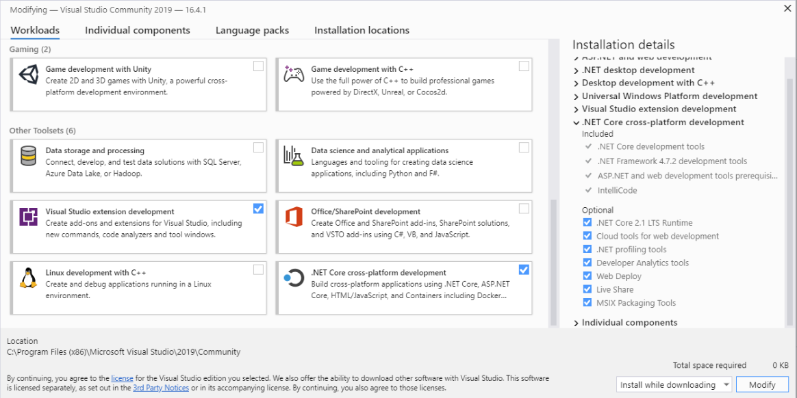

# Compiling a contract sample

So far, we have learned how to build a private chain and connect nodes to the chain. The following section will focus on configuring environment, creating, compiling, deploying and invoking a Neo smart contract on the private chain using C# and Windows 10.

We will complete the following tasks in this section:

1. Install contract development environment
2. Create a NEP-5 contract project
3. Compile a contract

## Installing development environment

### Install Visual Studio 2019

Download and install [Visual Studio 2019](https://www.visualstudio.com/products/visual-studio-community-vs) . Select `.NET Core cross-platform development` option during installation.



### Install NeoContractPlugin

Open Visual Studio 2019 and click `EXTENSIONS` -> `Manage Extensions`，click `Online` on the left column, search "Neo" and install NeoContractPlugin (the process must be completed online).


### Configure compiler

1. Pull [neo-devpack-dotnet](https://github.com/neo-project/neo-devpack-dotnet) project from GitHub to your localhost and open it.
2. Switch the branch to `master-2.x` (Currently the master branch is the Neo3 compiler)
3. Publish the project `Neo.Compiler.MSIL`
4. After successfully published, you can find `neon.exe` under the path ...\Neo.Compiler.MSIL\bin\Release\netcoreapp3.1\publish\

### Change environment variables

Next we need to add neon.exe to the Path environment variable using the following method to allow it to be accessible from any location:

1. For Windows 10, press Windows+S, input environment parameter and select `Edit the system enviroment variables`.
2. Select Path and click `edit`:
3. Click `create` in the popped up window and input your file filer directory that contains neon.exe, then press `confirm`.

> [!Note]
>
> Do not add a path that contains “…… neon.exe” in the environment variable field. Remember to input the path of the **file folder directory** that contains neon.exe instead of the path of neon.exe file.

After the Path is added, run CMD or PowerShell for testing purpose (if CMD is running before the Path is added, remember to restart it). If no error is reported after inputting neon and the system sends the prompt message containing version number as follows, it means that the environment variable configuration is successful.


## Creating a Neo contract project

Upon completion of the previous steps, you may start to create a Neo smart contract project in Visual Studio (no specific requirement for .NET Framework version):

1. Click `file` -> `create` -> `project`.
2. Select `NeoContract` in the list and change settings where necessary, then click `confirm`.


A C# file will be auto-generated after the project is created with a default class inherited from the SmartContract class. As indicated in the screenshot below, now you have a Hello World contract!


Nevertheless, the above only demonstrates a simple data storage method - to store data in the private storage of the contract using key-value pairs.

## Editing NEP-5 code

Many developers are curious about how to release their own contract assets on Neo public chain. Now let's walk through the process on private chain.

1. Download the NEP-5 template from [Github](https://github.com/neo-project/examples).

2. Create a Neo smart contract project in Visual Studio and name it NEP5.

3. Open NEP5.cs

   The code contains basic information of the assets and the methods available to be invoked. You can make changes when needed.

   > [!NOTE]
   >
   > If there are red underlines under the code warning that the system is unable to find Neo name space and there is "!" in project references, you may take the following steps:
   >
   > Right click the solution file in VS, click `Manage NuGet Packages...` and in the newly opened page, update the Neo.SmartContract.Framework to the latest official version. If the red underlines still exist when program update is completed, you may try double clicking the "!". If the problem remains unsolved, you may try the steps below:
   >
   > 1. Download nuget.exe [here](https://www.nuget.org/downloads) and copy it to the root directory of NeoContract project.
   > 2. Open PowerShell or command prompt (CMD).
   > 3. Redirect to the root directory of NeoContract project and run `nuget restore`.

4. Here we make certain modifications to the example files as follows:

   - Define the total asset amount and the `deploy` method.
   - Replace "Owner" with the address in 0.json (otherwise the wallet assets won't be accessible).

   The code is as follows:

```c#
using Neo.SmartContract.Framework;
using Neo.SmartContract.Framework.Services.Neo;
using Neo.SmartContract.Framework.Services.System;
using System;
using System.ComponentModel;
using System.Numerics;

namespace NEP5
{
    public class NEP5 : SmartContract
    {
        [DisplayName("transfer")]
        public static event Action<byte[], byte[], BigInteger> Transferred;

        private static readonly byte[] Owner = "Ad1HKAATNmFT5buNgSxspbW68f4XVSssSw".ToScriptHash(); //Owner Address
        private static readonly BigInteger TotalSupplyValue = 10000000000000000;

        public static object Main(string method, object[] args)
        {
            if (Runtime.Trigger == TriggerType.Verification)
            {
                return Runtime.CheckWitness(Owner);
            }
            else if (Runtime.Trigger == TriggerType.Application)
            {
                var callscript = ExecutionEngine.CallingScriptHash;

                if (method == "balanceOf") return BalanceOf((byte[])args[0]);

                if (method == "decimals") return Decimals();

                if (method == "deploy") return Deploy();

                if (method == "name") return Name();

                if (method == "symbol") return Symbol();

                if (method == "supportedStandards") return SupportedStandards();

                if (method == "totalSupply") return TotalSupply();

                if (method == "transfer") return Transfer((byte[])args[0], (byte[])args[1], (BigInteger)args[2], callscript);
            }
            return false;
        }

        [DisplayName("balanceOf")]
        public static BigInteger BalanceOf(byte[] account)
        {
            if (account.Length != 20)
                throw new InvalidOperationException("The parameter account SHOULD be 20-byte addresses.");
            StorageMap asset = Storage.CurrentContext.CreateMap(nameof(asset));
            return asset.Get(account).AsBigInteger();
        }
        [DisplayName("decimals")]
        public static byte Decimals() => 8;

        private static bool IsPayable(byte[] to)
        {
            var c = Blockchain.GetContract(to);
            return c == null || c.IsPayable;
        }

        [DisplayName("deploy")]
        public static bool Deploy()
        {
            if (TotalSupply() != 0) return false;
            StorageMap contract = Storage.CurrentContext.CreateMap(nameof(contract));
            contract.Put("totalSupply", TotalSupplyValue);
            StorageMap asset = Storage.CurrentContext.CreateMap(nameof(asset));
            asset.Put(Owner, TotalSupplyValue);
            Transferred(null, Owner, TotalSupplyValue);
            return true;
        }

        [DisplayName("name")]
        public static string Name() => "GinoMo"; //name of the token

        [DisplayName("symbol")]
        public static string Symbol() => "GM"; //symbol of the token

        [DisplayName("supportedStandards")]
        public static string[] SupportedStandards() => new string[] { "NEP-5", "NEP-7", "NEP-10" };

        [DisplayName("totalSupply")]
        public static BigInteger TotalSupply()
        {
            StorageMap contract = Storage.CurrentContext.CreateMap(nameof(contract));
            return contract.Get("totalSupply").AsBigInteger();
        }
#if DEBUG
        [DisplayName("transfer")] //Only for ABI file
        public static bool Transfer(byte[] from, byte[] to, BigInteger amount) => true;
#endif
        //Methods of actual execution
        private static bool Transfer(byte[] from, byte[] to, BigInteger amount, byte[] callscript)
        {
            //Check parameters
            if (from.Length != 20 || to.Length != 20)
                throw new InvalidOperationException("The parameters from and to SHOULD be 20-byte addresses.");
            if (amount <= 0)
                throw new InvalidOperationException("The parameter amount MUST be greater than 0.");
            if (!IsPayable(to))
                return false;
            if (!Runtime.CheckWitness(from) && from.AsBigInteger() != callscript.AsBigInteger())
                return false;
            StorageMap asset = Storage.CurrentContext.CreateMap(nameof(asset));
            var fromAmount = asset.Get(from).AsBigInteger();
            if (fromAmount < amount)
                return false;
            if (from == to)
                return true;

            //Reduce payer balances
            if (fromAmount == amount)
                asset.Delete(from);
            else
                asset.Put(from, fromAmount - amount);

            //Increase the payee balance
            var toAmount = asset.Get(to).AsBigInteger();
            asset.Put(to, toAmount + amount);

            Transferred(from, to, amount);
            return true;
        }
    }
}

```

When the editing is done, the coding part of the smart contract is finished.

## Compiling contract file

Click `Build` -> `Build Solutions` (hotkeys: Ctrl + Shift + B) in the menu to start compilation.


When the compilation is done, Neo smart contract file named `NeoContract1.avm` is generated in the `bin/Debug` directory of the project.


`NeoContract1.abi.json` is a descriptive file of the smart contract, which contains desciptions of the ScriptHash, entry, parameters and return values of the contract. For more information about the smart contract ABI file, refer to [NeoContract ABI](https://github.com/neo-project/proposals/blob/master/nep-3.mediawiki).

## What's next?

[Deploying and invoking contract](deploy.md)
